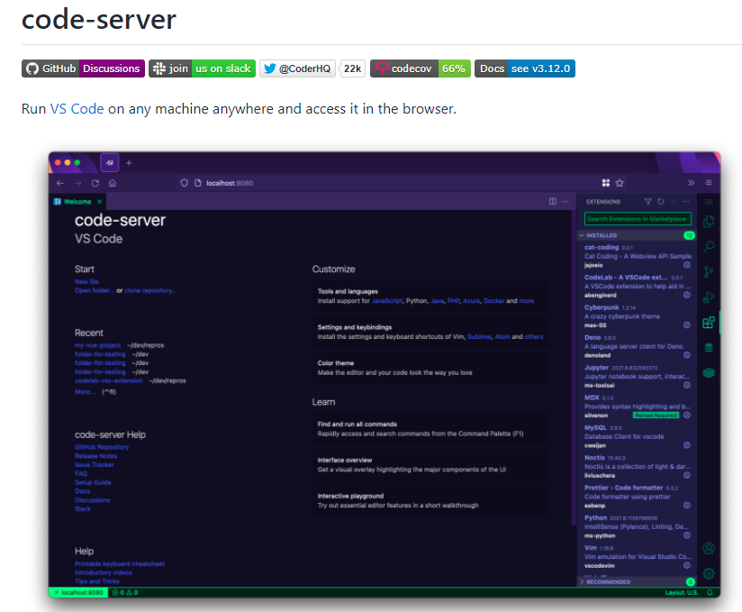
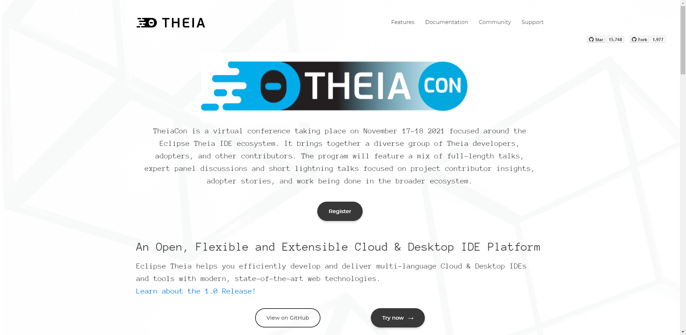

# Code Editor in browser

身為一個的工程師 , 當 PM 告知我們有些程式有 BUG 時 , 我們會希望馬上連線到伺服器 , 去修正我們之前寫的一些錯誤

如果 code 已經上傳到伺服器 , 我們恨不得直接修改伺服器上面的 code

不過使用 putty.exe 做 ssh 連線 , 之後 vim 一行一行的改 code 實在太慢了

下面我們來介紹一些 , 可以在伺服器上修改 code 一些特殊的 code editor 吧 !

> [Code-Server Alternatives - Self Hosted IDE/Tools | LibHunt](https://selfhosted.libhunt.com/code-server-alternatives)
> [Awesome-Selfhosted - 許多的免費自架工具](https://github.com/awesome-selfhosted/awesome-selfhosted)

### [1. code-server](https://github.com/cdr/code-server)

> 可以利用 aws . azure... 等雲端服務功能 , 架設一個 server 上面可以直接使用 vscode editor on browser

https://theia-ide.org/

### [2. theia](https://theia-ide.org/)

> 基於 Eclipse 的模仿 cloud 9 瀏覽器 code editor

